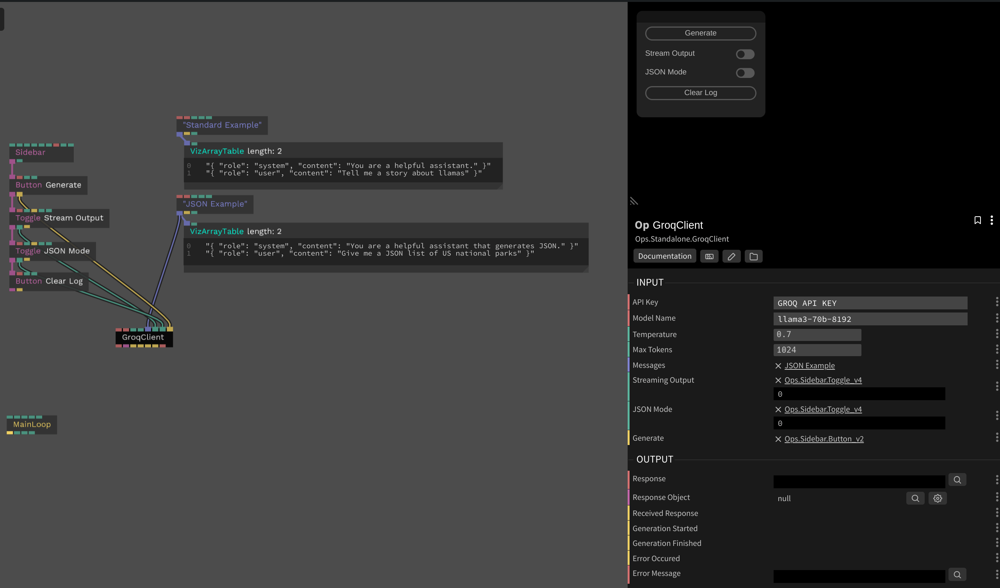

# Groq Client

This op uses the [`groq-sdk`](https://www.npmjs.com/package/groq-sdk) package to implement a Groq API client. It supports streaming responses and JSON mode.

[Groq](https://groq.com/) offers a generous free tier for their API, and their inference for most models exceeds 1000 tokens per second.

### Inputs

* Model Name - `string` - The name of the Groq model to use
* Max Tokens - `number` - The maximum number of tokens to generate. Defaults to 1024
* Temperature - `number` - The temperature of the response. Defaults to 0.
* Streaming Output - `boolean` - Whether to stream the response. Defaults to false
* JSON Mode - `boolean` - Whether to return the response in JSON format. Defaults to false. This seems to be mostly broken in Groq, it struggles to consistently generate valid JSON.
* Generate - `trigger` - Sends the messages to the Groq API

### Outputs

* Response - `string` - The response from the Groq API
* Response Object - `object` - The response object from the Groq API (only if JSON Mode is enabled)
* Received Response - `trigger` - Emitted when a response is received (triggered for each chunk when streaming mode is enabled)
* Generation Started - `trigger` - Emitted when the generation is started
* Generation Finished - `trigger` - Emitted when the generation is finished
* Error Occured - `trigger` - Emitted when an error occurs
* Error Message - `string` - The error message

### Screenshot

