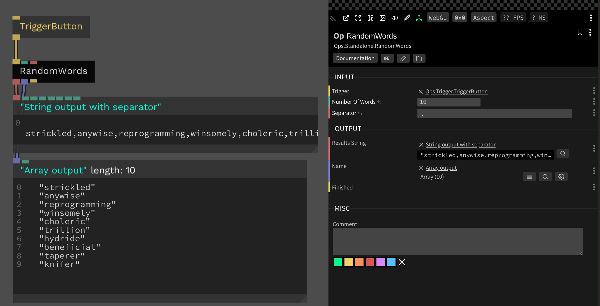

# Random Words Generator

This op uses the [`niceware`](https://www.npmjs.com/package/niceware) package to implement a random words generator. It supports string output with a separator and array output.

## Inputs

* Number of Words - `number` - The number of words to generate
* Separator - `string` - The separator to use between words

## Outputs

* Results String - `string` - The generated words in a string, joined with the separator character
* Results Array - `string[]` - The generated words in an array
* Finished - `trigger` - Emitted when the operation is finished

## Screenshot

