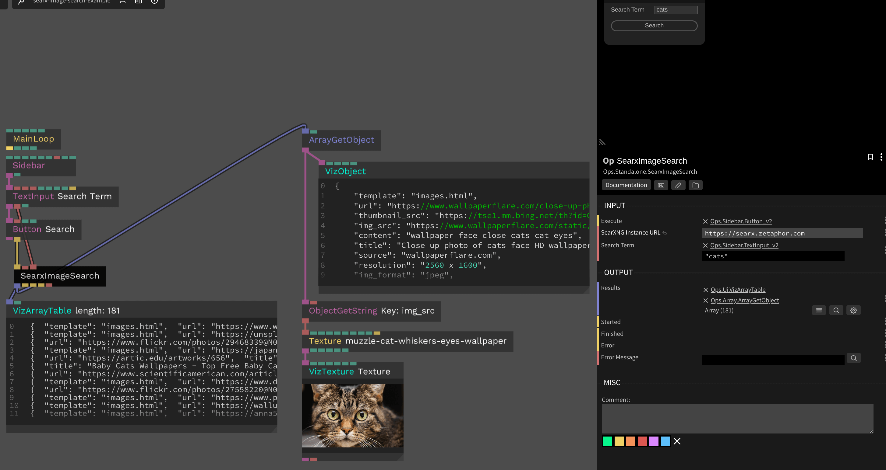

# SearXNG Image Search

This op to implements image search using the [SearXNG API](https://docs.searxng.org/dev/search_api.html). [SearXNG](https://searxng.org/) is a self-hosted meta-search engine, so you will need to provide an instance URL. You can host SearXNG locally or use someone else's public instance. Note that you will the instance owner will need to have enabled the JSON output format in the SearXNG configuration as it's not there by default.

This is serves as an alternative to the SerpAPI image search op as it doesn't require an API key and has no rate limiting.

## Inputs

* Execute - `trigger` - Execute the Google Image search using SearXNG
* Instance URL - `string` - The URL of the SearXNG instance
* Search Term - `string` - The search term to search for

## Outputs

* Results - `array` - An array of objects containing the full data for each search result
* Started - `trigger` - Emitted when the search is started
* Finished - `trigger` - Emitted when the search is finished
* Error - `trigger` - Emitted when an error occurs
* Error Message - `string` - The error message

## Screenshot

