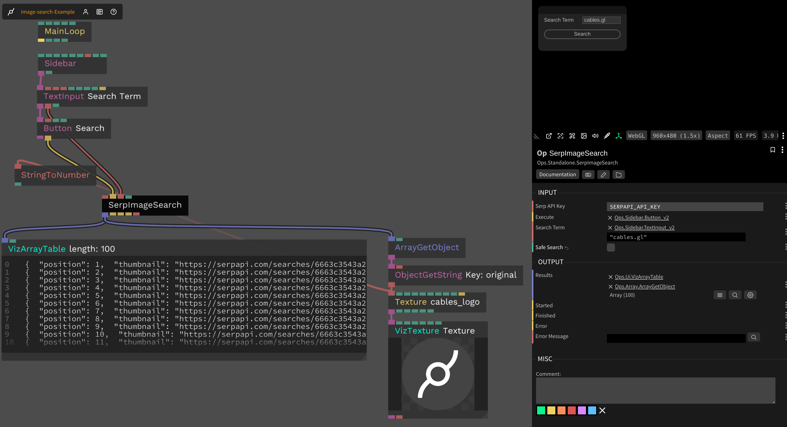

# SerpAPI Google Image Search

This op uses the [`serpapi`](https://www.npmjs.com/package/serpapi) package to implement a Google Image Search op using the [SerpAPI service](https://serpapi.com). It requires an API key, their free plan allows for 100 requests per month.

## Inputs

* Execute - `trigger` - Execute the Google Image search using SerpAPI
* Serp API Key - `string` - Your Serp API key
* Search Term - `string` - The search term to search for
* Safe Search - `boolean` - Whether to enable safe search

## Outputs

* Results - `array` - An array of objects containing the full data for each search result
* Started - `trigger` - Emitted when the search is started
* Finished - `trigger` - Emitted when the search is finished
* Error - `trigger` - Emitted when an error occurs
* Error Message - `string` - The error message

## Screenshot

