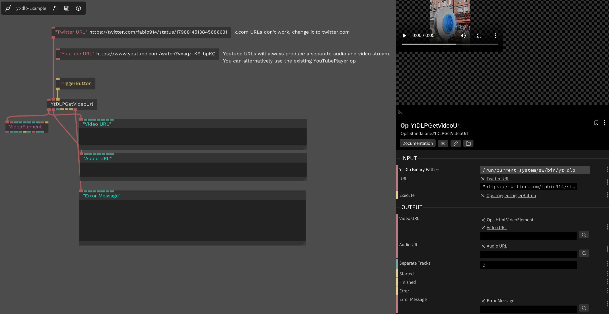

# yt-dlp Video URL Grabber

This op uses the [`yt-dlp-wrap`](https://www.npmjs.com/package/yt-dlp-wrap) package to implement a yt-dlp interface for generating direct video/audio URL from a video provider.

[yt-dlp supports ~1800 video providers](https://github.com/yt-dlp/yt-dlp/blob/master/supportedsites.md), making it simple to grab a direct video link from almost any URL on the web.

### Inputs

* yt-dlp Binary Path - `string` - The path to the yt-dlp binary. You can download the latest version from https://github.com/yt-dlp/yt-dlp/releases
* URL - `string` - The video page URL to process
* Execute - `trigger` - Execute the yt-dlp command

### Outputs

* Video URL - `string` - The video URL
* Audio URL - `string` - The audio URL (some video providers use separated audio and video tracks, ie: Youtube)
* Separate Tracks - `boolean` - Whether the video provider uses separate audio and video tracks
* Started - `trigger` - Emitted when the yt-dlp command is started
* Finished - `trigger` - Emitted when the yt-dlp command is finished
* Error - `trigger` - Emitted when an error occurs
* Error Message - `string` - The error message

### Screenshot

