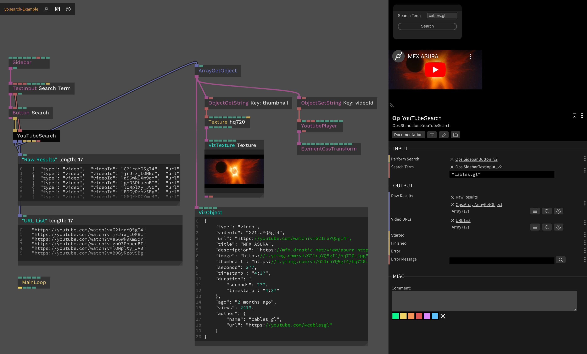

# Youtube Search

This op uses the [`yt-search`](https://www.npmjs.com/package/yt-search) package to implement a youtube search op without requring an API key.

## Inputs

* Search Term - `string` - The search term to search for
* Execute - `trigger` - Execute the yt-search command

## Outputs

* Raw Results - `array` - An array of objects containing the full data for each search result
* Video URLs - `array` - An array of video URLs
* Started - `trigger` - Emitted when the search is started
* Finished - `trigger` - Emitted when the search is finished
* Error - `trigger` - Emitted when an error occurs
* Error Message - `string` - The error message

## Screenshot

