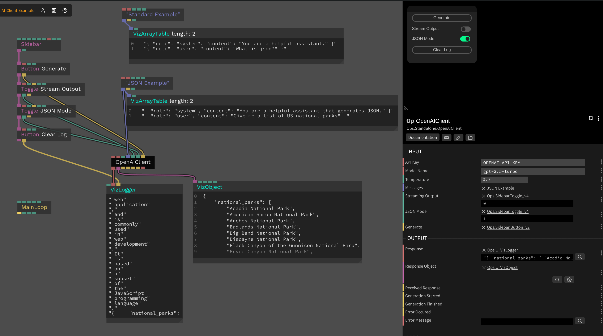

# OpenAI Client

This op uses the `openai` package from NodeJS to implement an OpenAI API client. It supports streaming responses and JSON mode.

### Inputs

* Base URL - `string` - The base URL of the OpenAI API. Leave "Default" to use the default base URL. This can be set to any OpenAI API compatible API URL
* API Key - `string` - The OpenAI API key
* Model Name - `string` - The name of the OpenAI model to use
* Temperature - `number` - The temperature of the response. Defaults to 0.7
* Messages - `array` - An array of messages to send to the OpenAI API. This should be an array of JSON strings
* Streaming Output - `boolean` - Whether to stream the response. Defaults to false
* JSON Mode - `boolean` - Whether to return the response in JSON format. Defaults to false
* Generate - `trigger` - Sends the messages to the OpenAI API

### Outputs

* Response - `string` - The response from the OpenAI API
* Response Object - `object` - The response object from the OpenAI API (only if JSON Mode is enabled)
* Received Response - `trigger` - Emitted when a response is received (triggered for each chunk when streaming mode is enabled)
* Generation Started - `trigger` - Emitted when the generation is started
* Generation Finished - `trigger` - Emitted when the generation is finished
* Error Occured - `trigger` - Emitted when an error occurs
* Error Message - `string` - The error message

### Screenshot

