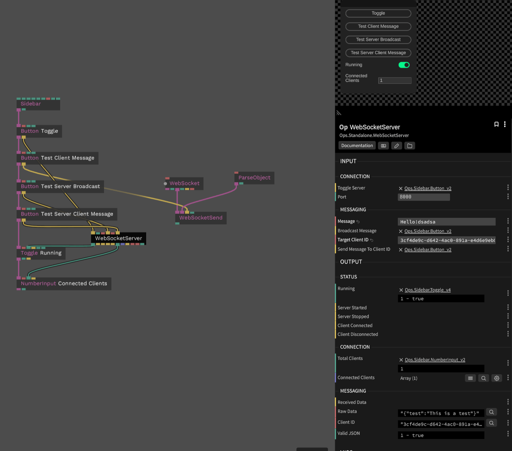

# Websocket Server

* [Download](https://github.com/Zetaphor/cables-patches-ops/blob/main/downloads/websocket-server.zip?raw=true)

This op uses the `ws` package from NodeJS to implement a WebSocket server. This can be used to commuinicate with the browser, other cables patches, or native applications.

### Inputs

* Toggle Server - `trigger` Toggles the server on and off
* Port - `integer` - The port to listen on. Defaults to 8000
* Message - `string` - The message to send to a client
* Target Client ID - `string` - The ID of the client to send the message to
* Broadcast Message - `trigger` - Sends the message to all connected clients
* Send Message To Client ID - `trigger` - Sends the message to the target client ID

### Outputs

* Running - `boolean` - Whether the server is running
* Server Started - `trigger` - Emitted when the server is started
* Server Stopped - `trigger` -  Emitted when the server is stopped
* Client Connected - `trigger` - Emitted when a client connects
* Client Disconnected - `trigger` - Emitted when a client disconnects
* Total Clients - `integer` - The total number of connected clients
* Connected Clients - `array` - An array of the IDs of the connected clients
* Received Data - `trigger` - Emitted when a message is received from a client
* Raw Data - `string` - The raw data received from a client
* Client ID - `string` - The ID of the client that sent the message
* Valid JSON - `boolean` - Whether the received data is valid JSON

### Screenshot

